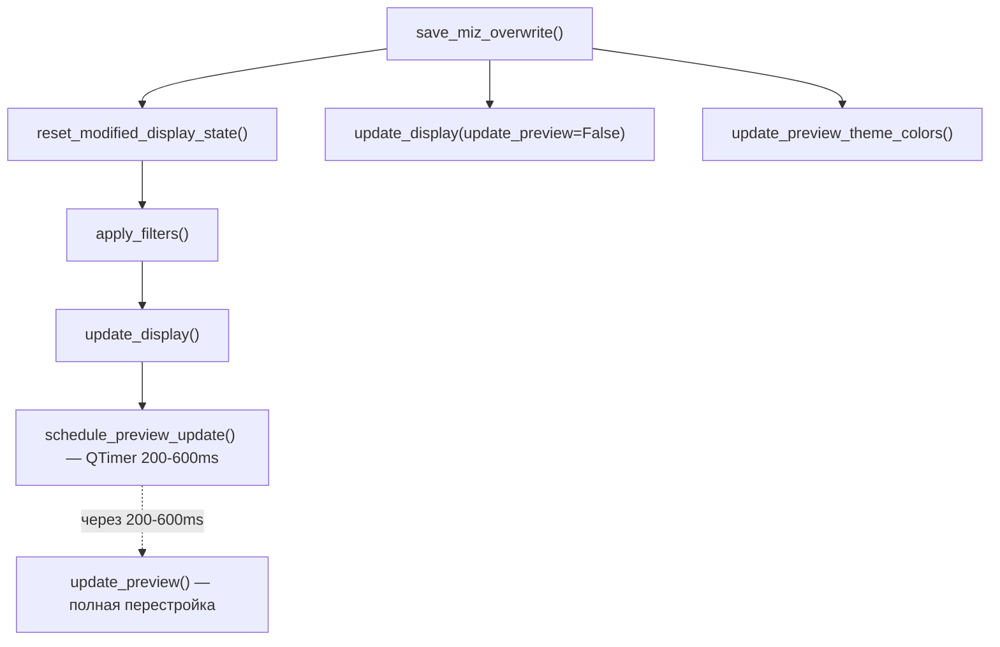

# Глубокий аудит: цветовая индикация текста в превью

## Три цвета текста

| Состояние | Цвет | Переменная |
|---|---|---|
| Не изменялся | Зелёный `#2ecc71` | `theme_text_saved` |
| Изменён, не сохранён | Красный `#ff6666` | `theme_text_modified` |
| Изменён и сохранён в сессии | Салатовый `#bbf324` | `theme_text_session` |

## Обнаруженные проблемы

### Проблема 1: `session_modified` не выставлялся при сохранении ✅ ИСПРАВЛЕНО

В [reset_modified_display_state](file:///c:/Users/Andrei/Desktop/DCS%20translator%20TOOL/main.py#L10627) не помечались строки `session_modified=True` перед обновлением `original_translated_text`.

**Статус:** Уже исправлено в предыдущей правке.

---

### Проблема 2: Гонка таймеров (race condition) — причина нестабильности

**Цепочка вызовов при сохранении `.miz`:**



**Что происходит:**
1. [reset_modified_display_state](file:///c:/Users/Andrei/Desktop/DCS%20translator%20TOOL/main.py#10615-10688) обновляет данные (`session_modified`, `original_translated_text`) ✅
2. Вызывает [apply_filters](file:///c:/Users/Andrei/Desktop/DCS%20translator%20TOOL/main.py#6120-6286) → [update_display](file:///c:/Users/Andrei/Desktop/DCS%20translator%20TOOL/main.py#6316-6428) → **[schedule_preview_update()](file:///c:/Users/Andrei/Desktop/DCS%20translator%20TOOL/main.py#8850-8865)** — это **отложенный** вызов (200-600ms debounce)
3. Между тем, управление возвращается в `save_miz_save_as`, который вызывает [update_preview_theme_colors()](file:///c:/Users/Andrei/Desktop/DCS%20translator%20TOOL/main.py#6926-7038) — он обновляет цвета **на текущих (старых) виджетах**
4. Через 200-600ms [update_preview()](file:///c:/Users/Andrei/Desktop/DCS%20translator%20TOOL/main.py#7039-7159) **полностью уничтожает** старые виджеты и создаёт новые с правильными цветами из [_get_translation_color](file:///c:/Users/Andrei/Desktop/DCS%20translator%20TOOL/main.py#10689-10700)
5. **Нестабильность**: иногда пользователь видит обновлённые цвета от шага 3 (до перестройки), иногда — от шага 4 (после), а иногда видит красный цвет потому что [update_preview_theme_colors](file:///c:/Users/Andrei/Desktop/DCS%20translator%20TOOL/main.py#6926-7038) успел обновить стили, но виджет ещё не был пересоздан

**Решение:** В [reset_modified_display_state](file:///c:/Users/Andrei/Desktop/DCS%20translator%20TOOL/main.py#10615-10688) заменить вызов [apply_filters()](file:///c:/Users/Andrei/Desktop/DCS%20translator%20TOOL/main.py#6120-6286) на [apply_filters(full_rebuild=False)](file:///c:/Users/Andrei/Desktop/DCS%20translator%20TOOL/main.py#6120-6286) + **явный** [update_preview_theme_colors()](file:///c:/Users/Andrei/Desktop/DCS%20translator%20TOOL/main.py#6926-7038) вместо отложенной перестройки. Или лучше — **не вызывать** [apply_filters()](file:///c:/Users/Andrei/Desktop/DCS%20translator%20TOOL/main.py#6120-6286) вообще, так как при сохранении фильтры не меняются.

> [!IMPORTANT]
> На самом деле [apply_filters](file:///c:/Users/Andrei/Desktop/DCS%20translator%20TOOL/main.py#6120-6286) вызывается из [reset_modified_display_state](file:///c:/Users/Andrei/Desktop/DCS%20translator%20TOOL/main.py#10615-10688) потому что `is_empty` может измениться для строк, которые были пустыми, но теперь заполнены. Нельзя просто убрать [apply_filters](file:///c:/Users/Andrei/Desktop/DCS%20translator%20TOOL/main.py#6120-6286), но можно заменить отложенное обновление на немедленное обновление цветов.

---

### Проблема 3: Виджеты не обновляют цвет при hover / mouse enter-leave

После сохранения `_original_style` виджетов PreviewTextEdit может содержать **старый** красный цвет. При наведении мыши `leaveEvent` восстанавливает `_original_style`, и если он ещё красный — виджет опять краснеет. Новый `_original_style` устанавливается только при:
- Полной перестройке ([update_preview](file:///c:/Users/Andrei/Desktop/DCS%20translator%20TOOL/main.py#7039-7159) / [render_preview_batch](file:///c:/Users/Andrei/Desktop/DCS%20translator%20TOOL/main.py#7275-7660))
- Вызове [update_preview_theme_colors](file:///c:/Users/Andrei/Desktop/DCS%20translator%20TOOL/main.py#6926-7038)
- Вызове [on_preview_text_modified](file:///c:/Users/Andrei/Desktop/DCS%20translator%20TOOL/main.py#10701-10742)

---

## Proposed Changes

### [MODIFY] [main.py](file:///c:/Users/Andrei/Desktop/DCS%20translator%20TOOL/main.py)

#### Изменение 1: Немедленное обновление цветов после сброса данных

В [reset_modified_display_state](file:///c:/Users/Andrei/Desktop/DCS%20translator%20TOOL/main.py#10615-10688), после [apply_filters()](file:///c:/Users/Andrei/Desktop/DCS%20translator%20TOOL/main.py#6120-6286) — вызвать **немедленное** обновление цветов, а не полагаться на отложенный QTimer:

```diff
-            self.apply_filters()
+            self.apply_filters(full_rebuild=False)
+            # Немедленно обновляем цвета виджетов (без полной перестройки)
+            self.update_preview_theme_colors()
```

#### Изменение 2: Убрать дублирующие вызовы update_display / update_preview_theme_colors после save

В `save_miz_save_as` (строка ~9773-9775) — [update_display](file:///c:/Users/Andrei/Desktop/DCS%20translator%20TOOL/main.py#6316-6428) и [update_preview_theme_colors](file:///c:/Users/Andrei/Desktop/DCS%20translator%20TOOL/main.py#6926-7038) уже вызываются из [reset_modified_display_state](file:///c:/Users/Andrei/Desktop/DCS%20translator%20TOOL/main.py#10615-10688). Дублирование создаёт гонку.

```diff
-            if success:
-                self.update_display(update_preview=False)
-                try:
-                    self.update_preview_theme_colors()
```

## Verification Plan

### Manual Verification
1. Открыть `.miz` файл, добавить текст → строка красная. Сохранить → строка **салатовая**.
2. Навести/убрать курсор → цвет **не меняется**.
3. Не изменённые строки → **зелёные**.
4. Повторить 5 раз подряд — результат стабилен.
